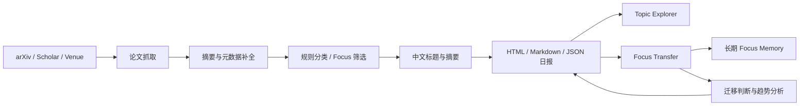

<div align="center">

# 📚 arXiv CV Daily Digest

### 面向计算机视觉研究者的论文自动抓取、中文摘要、主题探索与迁移分析工具

<p>
  自动追踪 <b>arXiv · Google Scholar · 顶会顶刊官网</b>，<br/>
  并围绕自定义 Focus 主题生成结构化中文研究日报。
</p>


</div>

---

## ✨ 项目简介

这是一个面向科研日常使用的 **自动论文追踪与研究分析流水线**。

它不仅可以每天抓取 `arXiv cs.CV` 最新论文，还能够完成：

- 📰 自动生成 HTML / Markdown / JSON 科研日报
- 🇨🇳 自动生成中文标题与中文摘要
- 🧭 基于标题与摘要进行领域、任务与论文类型分类
- 🎯 围绕指定研究方向构建 Focus 论文池
- 🧠 维护 Focus 方向长期研究记忆
- 🔄 分析其他领域论文向 Focus 方向迁移的可能性
- 🏆 提取 CVPR / ICCV / ECCV / NeurIPS / ICLR / TPAMI 等中稿或发表线索
- 🔍 提供论文主题探索器、搜索、排序、关系图与代表论文面板
- 🎓 独立支持 Google Scholar Focus 检索
- 🛰️ 独立支持顶会顶刊官网新增论文监控

> [!TIP]
> 如果只是日常使用，直接运行 `./digest_wizard.sh` 即可。它会通过交互式菜单完成大部分配置。

---

## 🚀 核心能力

| 模块 | 能力 |
|---|---|
| **arXiv Daily Digest** | 抓取 `cs.CV` / `cs.AI` 最新论文，生成结构化日报 |
| **中文化** | 中文标题、中文摘要、缓存复用、失败重试 |
| **Focus Pool** | 根据自定义研究关键词建立重点论文池 |
| **Topic Explorer** | 主题索引、搜索、排序、局部关系图、代表论文面板 |
| **Venue Clues** | 提取 CVPR / ICCV / ECCV / NeurIPS / ICLR / TPAMI 等发表线索 |
| **Focus Transfer** | 分析非 Focus 论文能否迁移到目标研究方向 |
| **Long-term Memory** | 为每个 Focus 关键词维护长期 Markdown 研究记忆 |
| **Google Scholar** | 基于 Focus 关键词追踪 Scholar 最新相关论文 |
| **Venue Monitor** | 监控顶会顶刊官网或官方论文索引新增条目 |
| **Incremental Fetching** | 自动跳过已抓论文，并按配置维护独立抓取状态 |
| **Failure Recovery** | 请求失败时回退最近一次成功快照，避免空报告 |

---

## 🧩 整体工作流



---

## ⚡ 快速开始

### 1. 推荐：交互式入口

```bash
./digest_wizard.sh
```

交互式菜单支持：

- 使用 `.env.digest` 默认配置运行
- 选择预设：`cv` / `ai` / `both` / `tracking` / `quick`
- 自定义领域、Focus 关键词、抓取数量、翻译后端等
- 设置报告文件后缀
- 选择是否保存本次配置
- 选择是否忽略已经抓取过的论文
- 预览命令但不执行
- 查看或打开最新 HTML 报告

> [!NOTE]
> 在自定义模式中，`arXiv 分类 / Focus 关键词 / 报告后缀` 留空会显式清空旧值，不会继承 `.env.digest` 中的残留配置。

### 2. 非交互预览

```bash
./digest_wizard.sh --dry-run --preset tracking
./digest_wizard.sh --dry-run --default
```

### 3. 底层直接运行

```bash
./run_daily_digest.sh
```

常用临时参数：

```bash
./run_daily_digest.sh --date 2026-03-27
./run_daily_digest.sh --domain ai
./run_daily_digest.sh --focus-terms "agent,reasoning,alignment,tool use"
./run_daily_digest.sh --focus-terms-extra "video reasoning,test-time inference"
./run_daily_digest.sh --ignore-fetched 1
./run_daily_digest.sh --output-suffix tracking_debug
./run_daily_digest.sh --daily-limit-per-cat 260
./run_daily_digest.sh --abs-enrich-limit -1 --report-abs-enrich-limit -1
./run_daily_digest.sh --focus-latest 100 --focus-hot 0 --venue-latest 0 --venue-watch-limit 100
./run_daily_digest.sh --llm-max-retries 4
./run_daily_digest.sh --model moonshot-v1-8k
```

---

## 📦 默认输出

```text
reports/
├── arxiv_digest_YYYY-MM-DD.html
├── arxiv_digest_YYYY-MM-DD.md
├── previous_reports/
└── focus_transfer/

data/
├── arxiv_digest_YYYY-MM-DD.json
├── last_success_digest.json
├── fetch_state/
├── focus_memory/
└── focus_transfer/
```

其中：

- `reports/arxiv_digest_YYYY-MM-DD.html`：主要可视化日报
- `reports/arxiv_digest_YYYY-MM-DD.md`：Markdown 版本日报
- `data/arxiv_digest_YYYY-MM-DD.json`：结构化论文数据
- `data/last_success_digest.json`：最近一次成功抓取的数据指针

每次通过 `./run_daily_digest.sh` 或 `./digest_wizard.sh` 生成新报告前，脚本会将 `reports/` 根目录中的旧日报 `html/md` 自动整理到：

```text
reports/previous_reports/
```

`reports/focus_transfer/` 不会被移动。

---

# 📰 arXiv Daily Digest

## 抓取策略

主分支默认：

- 仅抓取 `cs.CV`
- 使用 `recent/list` 作为稳定抓取入口
- 尽量规避 arXiv API `429`
- 请求失败时自动回退
- 使用最近一次成功快照避免生成空报告
- 对 `recent/list` 前 N 篇论文补抓 `abs` 页面
- 补充摘要、comment、journal reference 等元数据

中文化流程会：

1. 优先读取已有翻译缓存
2. 对缺失内容进行批量补译
3. 自动重试失败请求
4. 支持断点续跑缓存：

```text
data/llm_translation_cache.json
```

## 自动分类与中稿线索

系统会基于标题与摘要生成：

- 领域标签
- 任务标签
- 论文类型标签

同时从 `comment` / `journal_ref` 中提取潜在中稿或发表线索，包括但不限于：

`CVPR`、`ICCV`、`ECCV`、`NeurIPS`、`ICLR`、`TPAMI` 等。

日报中的“中稿线索总表”会展示：

- 中文标题
- 中文摘要
- 会刊信息
- 动态分组结果

## 论文主题探索器

HTML 日报内置独立的 **论文主题探索器**，参考 arXiv Sanity 一类工具的探索思路，提供：

- 主题索引
- 主题搜索
- 论文搜索
- 综合排序
- Focus 排序
- 中稿线索排序
- 局部关系图
- 代表论文面板

同时支持从入口切换：

```text
CV / AI
```

并可自定义 Focus 主题词。

---

# 🎯 Focus Pool

默认 Focus 方向包括：

```text
test-time adaptation
zero-shot
multimodal object tracking
rgb-x tracking
rgb-d tracking
rgb-e tracking
rgb-t tracking
distribution shift
domain shift
```

你可以在运行时完全覆盖：

```bash
./run_daily_digest.sh --focus-terms "agent,reasoning,alignment,tool use"
```

也可以在默认 Focus 后追加：

```bash
./run_daily_digest.sh --focus-terms-extra "video reasoning,test-time inference"
```

---

# 🔄 Focus Transfer

Focus Transfer 是主日报的研究分析扩展，用于回答一个更重要的问题：

> **其他研究方向的新论文，是否存在可以迁移到当前 Focus 研究方向的方法、机制或思想？**

## 它会做什么

Focus Transfer 会：

1. 复用主日报已经生成的 JSON
2. 自动识别其中的 Focus 与 non-Focus 论文
3. 分析当前 Focus 方向的发展趋势和热点问题
4. 对具备中稿线索的 non-Focus 论文逐篇分析
5. 判断其思想是否能够迁移到 Focus 领域
6. 将迁移分析重新写回主日报

分析结果会出现在：

- 日报顶部“可迁移性分析”状态区
- 知识图谱右侧论文卡片
- 图谱下方“发展趋势与热点问题”区域

同时仍会生成独立 Focus Transfer HTML 报告。

## 在主入口中启用

### `digest_wizard.sh`

```bash
./digest_wizard.sh
```

交互式流程中会询问是否启用 Focus Transfer，默认启用。

### `run_daily_digest.sh`

显式开启：

```bash
./run_daily_digest.sh --with-focus-transfer
```

显式关闭：

```bash
./run_daily_digest.sh --without-focus-transfer
```

只验证扩展文件链路，不调用模型：

```bash
./run_daily_digest.sh \
  --with-focus-transfer \
  --focus-transfer-backend none
```

> [!IMPORTANT]
> Focus Transfer 即使失败，主日报 HTML / JSON 仍会先正常生成，不会被扩展流程拖垮。

## 独立运行

```bash
./run_focus_transfer_extension.sh
```

默认读取：

```text
data/last_success_digest.json
```

也可以指定某次日报：

```bash
./run_focus_transfer_extension.sh \
  --digest-json data/arxiv_digest_2026-04-10.json
```

只验证文件链路和 HTML：

```bash
FOCUS_TRANSFER_ANALYSIS_BACKEND=none \
./run_focus_transfer_extension.sh \
  --digest-json data/arxiv_digest_2026-04-10.json
```

兼容入口仍然保留：

```bash
./run_research_workbench.sh
./run_research_autopilot.sh
./run_research_kimi_autopilot.sh
```

这些入口最终都会转向同一个 Focus Transfer 扩展脚本。

---

## 🧠 Focus 长期记忆

系统会为 **每一个单独的 Focus 关键词** 维护长期 Markdown 记忆，而不是为整组关键词维护一个文件。

例如：

```text
data/focus_memory/
├── test-time-adaptation_<hash>.md
├── multimodal-object-tracking_<hash>.md
├── rgb-x-tracking_<hash>.md
├── rgb-d-tracking_<hash>.md
├── rgb-e-tracking_<hash>.md
├── rgb-t-tracking_<hash>.md
├── distribution-shift_<hash>.md
└── domain-shift_<hash>.md
```

只要规范化后的 Focus 词相同，不同组合也会复用同一个记忆文件。

例如：

```text
test-time adaptation, domain shift
```

和：

```text
test-time adaptation, rgb-t tracking
```

都会读取同一份 `test-time adaptation` 长期记忆。

每次启用分析时，模型会结合当前 Focus 论文与已有记忆，重新整合：

- 任务定义
- 技术路线汇总
- 动机与启发
- 发展趋势与热点问题

之后，这些长期记忆会成为 non-Focus 论文迁移分析的参考上下文。

相关配置：

```bash
FOCUS_TRANSFER_MEMORY_DIR="data/focus_memory"
FOCUS_TRANSFER_MEMORY_CONTEXT_CHARS=6000
```

---

## 🤖 Focus Transfer 模型配置

Focus Transfer 默认使用 OpenRouter Elephant，也兼容其他 OpenAI-compatible 模型与 Kimi。

推荐在 `.env.digest` 中统一配置：

```bash
OPENROUTER_API_KEY="sk-or-..."
OPENROUTER_API_BASE="https://openrouter.ai/api/v1"
OPENROUTER_MODEL="openrouter/elephant-alpha"
```

临时切换至 Kimi：

```bash
KIMI_API_KEY="sk-..."
KIMI_API_BASE="https://api.moonshot.cn/v1"
KIMI_MODEL="moonshot-v1-32k"
```

配置读取优先级：

```text
FOCUS_TRANSFER_API_KEY
  ↓
OPENROUTER_API_KEY
  ↓
OPENAI_API_KEY
  ↓
KIMI_API_KEY
```

```text
FOCUS_TRANSFER_API_BASE
  ↓
OPENROUTER_API_BASE
  ↓
OPENAI_BASE_URL
  ↓
KIMI_API_BASE
```

```text
FOCUS_TRANSFER_MODEL
  ↓
OPENROUTER_MODEL
  ↓
OPENAI_MODEL
  ↓
KIMI_MODEL
```

因此正常情况下只需维护主配置。

可选覆盖：

```bash
FOCUS_TRANSFER_API_BASE="https://openrouter.ai/api/v1"
FOCUS_TRANSFER_API_KEY="sk-or-..."
FOCUS_TRANSFER_MODEL="openrouter/elephant-alpha"
```

查看当前实际配置：

```bash
./run_focus_transfer_extension.sh --print-config
```

该命令只显示 API Key 是否存在，不会打印 Key 本体。

---

## 📁 Focus Transfer 输出

```text
reports/focus_transfer/<packet>/
├── focus_transfer_report.html
├── focus_corpus.md
├── non_focus_candidates.md
├── focus_landscape_trends.md
├── focus_memory_index.md
└── paper_transfer_judgments.md
```

```text
data/focus_transfer/<packet>/
├── focus_papers.json
├── non_focus_papers.json
├── focus_landscape_trends.json
├── focus_memory_files.json
├── paper_transfer_judgments.json
├── transfer_graph.json
├── analysis_quality_gate.json
└── analysis_manifest.json
```

长期记忆位于：

```text
data/focus_memory/<focus-term>_<hash>.md
```

独立运行扩展前，旧 packet 会自动归档到各自的：

```text
previous_packets/<timestamp>/
```

---

# 🎓 Google Scholar 分支

Google Scholar 没有官方的“CV 全量最新论文”feed/API，而且页面抓取容易触发验证码或限流。

因此这一分支采用更稳妥的 **Focus 关键词抓取**：围绕当前 Focus 词检索最新结果，并复用主流程中的：

- 规则分类
- Google 翻译缓存
- 中文标题与摘要整理
- 知识图谱展示

## 运行

```bash
./run_google_scholar_digest.sh
```

常用参数：

```bash
./run_google_scholar_digest.sh --focus-terms "test-time adaptation,domain shift"
./run_google_scholar_digest.sh --queries "computer vision test-time adaptation;;RGB-T tracking" --max-results 60
./run_google_scholar_digest.sh --source serpapi
./run_google_scholar_digest.sh --source manual --input-json data/my_scholar_results.json
./run_google_scholar_digest.sh --source saved-html --input-html-glob 'data/scholar_pages/*.html'
./run_google_scholar_digest.sh --source alerts --input-alert-glob 'data/scholar_alerts/*.eml'
./run_google_scholar_digest.sh --source alerts --input-alert-mbox 'data/scholar_alerts/*.mbox'
./run_google_scholar_digest.sh --year-from 2026
./run_google_scholar_digest.sh --ignore-fetched 0
```

<details>
<summary><b>📌 Google Scholar 抓取策略与注意事项</b></summary>

<br/>

- 默认 `--source auto`
  - 配置 `SERPAPI_API_KEY` 时优先使用 SerpAPI
  - 否则尝试轻量 HTML 解析
- 默认不启用浏览器回退
- 当前按纯 shell 模式运行
- 遇到 `429 / sorry / captcha` 时明确报错退出，并保留旧报告
- 每个 Focus 词默认只请求 `start=0`
- 当首页结果全部已抓取后，才根据 `data/google_scholar_query_state.json` 的 `next_start` 继续翻页
- Scholar 跳转链接会自动解析为外部真实论文链接
- 详情页请求只访问外部论文站点，不重复请求 Scholar
- 单个 query 遇到 `429` 后不会立即重复撞同一入口
- 被限流 query 会进入冷却状态并优先复用缓存
- 如果需要有人值守浏览器回退，可显式：

```bash
--browser-fallback 1
```

更稳定的离线替代方式：

```bash
--source saved-html
--source alerts
```

其中：

- `saved-html`：解析浏览器手动保存的 Scholar 结果页
- `alerts`：解析 Scholar Alert 导出的 `.eml` / `.mbox`

其他行为：

- `--query-mode all-cv` 仅为 broad query best-effort，不等价于 arXiv `cs.CV` 全量抓取
- 默认通过 Scholar URL 的 `as_ylo=<当前年份>` 做年份过滤
- `focus` 模式下，每个 Focus 关键词单独查询
- 不额外拼接 `computer vision` 前缀
- 不把多个 Focus 合并成一条 query
- 默认 `--require-full-abstract 1`
- 默认 `--ignore-fetched 1`
- 若 Scholar 返回验证码或 `429`，不会覆盖已有报告为空文件
- JSON 中使用 `full_text_status` 标识全文与摘要状态
- 中稿线索来自 publication line、`citation_journal_title`、`citation_conference_title`

已抓取状态：

```text
data/google_scholar_seen_state.json
```

仅保存：

- `keys`
- `records`

其中 `records` 只包含：

```text
title / url / year / added_on
```

身份键优先级：

1. DOI
2. arXiv ID
3. 规范化详情页 URL
4. 规范化标题 + venue + 年份指纹
5. 标题指纹

查询进度独立保存在：

```text
data/google_scholar_query_state.json
```

它只负责：

- 当前 query 的 `start`
- 最近成功结果页缓存
- 最近一次被 Scholar 限流的时间

不会存储论文正文数据。

</details>

### Scholar 输出

```text
reports/google_scholar_digest_YYYY-MM-DD_scholar.html
reports/google_scholar_digest_YYYY-MM-DD_scholar.md
data/google_scholar_digest_YYYY-MM-DD_scholar.json
```

---

# 🏆 顶会顶刊官网监控

该分支用于监控 CV 领域顶会顶刊官网或官方论文索引是否出现新条目。

默认包括：

```text
CVPR · ICCV · ECCV · NeurIPS · ICLR
TPAMI · IJCV · ICML · AAAI · ACM MM
```

## 运行

```bash
./run_venue_monitor.sh
```

常用参数：

```bash
./run_venue_monitor.sh --include-seen 1
./run_venue_monitor.sh --per-source-limit 120
./run_venue_monitor.sh --source-config data/my_venue_sources.json
```

## 自定义数据源

```json
[
  {
    "venue": "CVPR",
    "kind": "cvf",
    "url": "https://openaccess.thecvf.com/CVPR2026?day=all"
  },
  {
    "venue": "IJCV",
    "kind": "generic",
    "url": "https://link.springer.com/journal/11263/online-first"
  }
]
```

说明：

- 默认源覆盖 CVF OpenAccess、OpenReview、PMLR 与出版社官网等公开入口
- 动态页面或订阅页可能只能解析到标题级条目或抓取状态
- 新发现条目会写入：

```text
data/venue_monitor_state.json
```

后续默认只报告未见过的新条目。

### 输出

```text
reports/venue_monitor_YYYY-MM-DD_venue_monitor.html
reports/venue_monitor_YYYY-MM-DD_venue_monitor.md
data/venue_monitor_YYYY-MM-DD_venue_monitor.json
```

---

# 🇨🇳 中文标题与摘要

默认：

```bash
TRANSLATE_BACKEND=google
```

此模式使用 Google Translate 免费翻译，不调用 LLM API。

如果希望优先使用 LLM，再用 Google Translate 兜底：

```bash
./run_daily_digest.sh --translate-backend auto
```

## OpenAI-compatible 配置

```bash
export OPENAI_API_KEY="<YOUR_KEY>"
export OPENAI_MODEL="gpt-5-mini"
./run_daily_digest.sh
```

未配置 Key 时，脚本会使用回退文案，不会中断整个流程。

## Kimi / Moonshot

```bash
export KIMI_API_KEY="<YOUR_KIMI_KEY>"
export KIMI_API_BASE="https://api.moonshot.cn/v1"
export KIMI_MODEL="moonshot-v1-8k"
./run_daily_digest.sh
```

推荐写入项目根目录：

```text
.env.digest
```

例如：

```bash
KIMI_API_KEY="<YOUR_KIMI_KEY>"
KIMI_API_BASE="https://api.moonshot.cn/v1"
KIMI_MODEL="moonshot-v1-8k"
```

这样更适合 cron 等非交互式运行。

---

# ⚙️ 关键环境变量

<details open>
<summary><b>📌 arXiv 与 Focus</b></summary>

<br/>

| 变量 | 默认值 | 说明 |
|---|---:|---|
| `DIGEST_TZ` | `Asia/Shanghai` | 日报时区 |
| `DIGEST_DOMAIN` | `cv` | 可选 `cv` / `ai` / `both` |
| `ARXIV_CATEGORIES` | 自动推导 | 留空时由 `DIGEST_DOMAIN` 推导 |
| `ARXIV_MODE` | `recent_only` | arXiv 抓取模式 |
| `DAILY_LIMIT_PER_CAT` | `260` | latest 补抓数量 |
| `ARXIV_PAGE_SIZE` | `200` | 单页数量 |
| `ARXIV_MAX_SCAN` | `5000` | 最大扫描量 |
| `FOCUS_LATEST_N` | `100` | Focus 最新池数量 |
| `FOCUS_HOT_N` | `0` | Focus 热门池，默认禁用 |
| `FOCUS_API_ENABLE` | `0` | arXiv Focus API，默认禁用 |
| `FOCUS_RECENT_SCAN` | `1200` | Focus 扫描范围 |
| `FOCUS_TERMS_OVERRIDE` | 空 | 完全替换默认 Focus |
| `FOCUS_TERMS_EXTRA` | 空 | 在默认 Focus 后追加 |
| `VENUE_LATEST_N` | `0` | 会刊 latest，默认禁用 |
| `VENUE_WATCH_LIMIT` | `100` | 会刊监控数量 |

</details>

<details>
<summary><b>📄 摘要补全与翻译</b></summary>

<br/>

| 变量 | 默认值 | 说明 |
|---|---:|---|
| `ABS_ENRICH_LIMIT` | `-1` | 对日报全部论文补抓 abs，正数时仅前 N 篇 |
| `FOCUS_ABS_ENRICH_LIMIT` | `0` | Focus 扩展池 abs 补抓 |
| `REPORT_ABS_ENRICH_LIMIT` | `-1` | 翻译前补全缺失摘要 |
| `TRANSLATE_MODEL` | `moonshot-v1-8k` | 轻量翻译模型 |
| `TRANSLATE_BACKEND` | `google` | `llm` / `google` / `auto` |
| `LLM_LIMIT` | `-1` | 全部论文尝试中文化；`0` 禁用 |
| `LLM_MAX_RETRIES` | `2` | LLM 最大重试次数 |
| `LLM_FAILED_COOLDOWN_HOURS` | `24` | 失败条目冷却时间 |
| `LLM_TIMEOUT_SECONDS` | `25` | LLM 超时 |
| `GOOGLE_TRANSLATE_TIMEOUT_SECONDS` | `12` | Google Translate 超时 |
| `GOOGLE_TRANSLATE_LIMIT` | `-1` | Google 翻译数量限制 |
| `GOOGLE_SUMMARY_SENTENCES` | `3` | 摘要式翻译时抽取句数 |
| `GOOGLE_TRANSLATE_FULL_ABSTRACT` | `1` | 默认翻译完整摘要 |
| `OPENAI_API_KEY` | - | OpenAI-compatible API Key |
| `OPENAI_MODEL` | `gpt-5-mini` | OpenAI-compatible 模型 |

</details>

<details>
<summary><b>🗂️ 增量抓取</b></summary>

<br/>

| 变量 | 默认值 | 说明 |
|---|---:|---|
| `IGNORE_FETCHED_ARTICLES` | `1` | 忽略当前配置下已抓论文 |

</details>

---

# 🗂️ 已抓取记录

主流程会根据当前抓取配置生成独立状态文件，默认位于：

```text
data/fetch_state/
```

配置签名综合考虑：

- 领域
- arXiv 分类
- 抓取模式
- 日报数量
- Focus 数量
- 会刊线索数量
- Focus 关键词集合

因此，当领域、关键词或关键抓取参数变化时，会自动切换到新的状态文件，避免不同实验配置互相污染。

状态文件会维护：

- 当前配置签名
- 已抓取 arXiv ID 集合
- 最新已抓取 arXiv ID
- 最早已抓取 arXiv ID
- 最近一次运行统计

当：

```bash
IGNORE_FETCHED_ARTICLES=1
```

时，系统会：

1. 优先抓取比当前“最新已抓取 arXiv ID”更晚的新论文
2. 如果新论文数量不足，再回补更早但尚未抓取的论文
3. 同一配置下不会重复输出已经记录过的论文

HTML 首页同时展示：

- 本次新增数
- 本次回补数
- 已见忽略数
- 当前配置状态文件

---

## 🧪 推荐使用方式

如果你的目标是每天跟踪某个研究方向，例如：

```text
Test-Time Adaptation
RGB-T Tracking
Multimodal Object Tracking
Distribution Shift
```

推荐流程是：

```bash
./digest_wizard.sh
```

然后：

1. 选择 `tracking` 或自定义模式
2. 设置 Focus 关键词
3. 开启增量抓取
4. 开启 Focus Transfer
5. 浏览生成的 HTML 日报
6. 从 Topic Explorer 查看重点论文
7. 查看 Focus Transfer 给出的迁移思路与长期趋势

这样可以把普通的“论文列表”进一步变成持续更新的 **个人研究情报系统**。

---

<div align="center">

### 🌱 From paper tracking to research intelligence.

如果这个项目正在帮助你的科研工作，可以考虑给仓库一个 ⭐。

</div>
